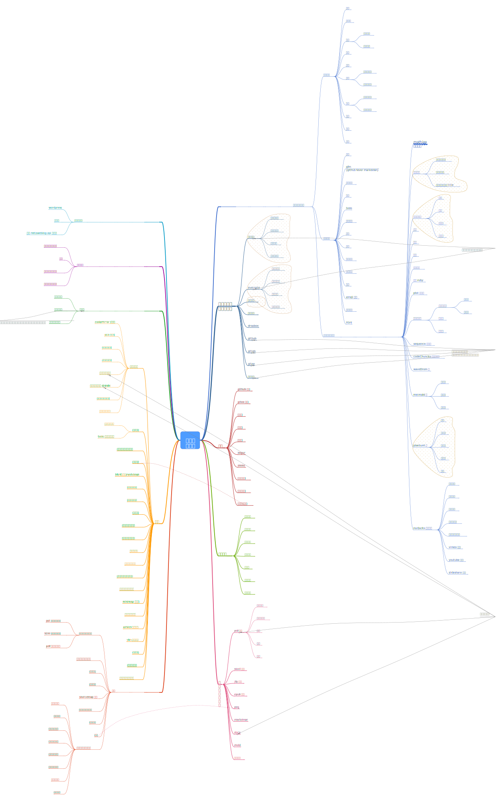

### 小书匠

Just for http://soft.xiaoshujiang.com issues

### 其他

- [小书匠官网](http://www.xiaoshujiang.com)源码地址: https://github.com/suziwen/roadbike
- Sculpting : https://github.com/suziwen/gatsby-theme-sculpting  
  (一款基于 Gatsby ,并使用小书匠导出的 zip 做为数据源的博客主题)
- 个人笔记 : https://suziwen.github.io/acorns/ (源码地址: https://github.com/suziwen/acorns)  
  这里主要记录自己平时工作,开发收集到的资料,并进行归类整理,方便将来的查找,同时也记录了自己平时生活,运动等内容.

